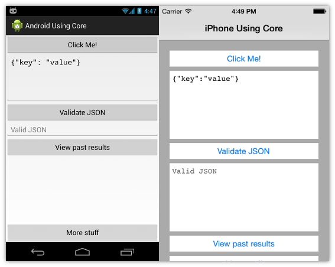
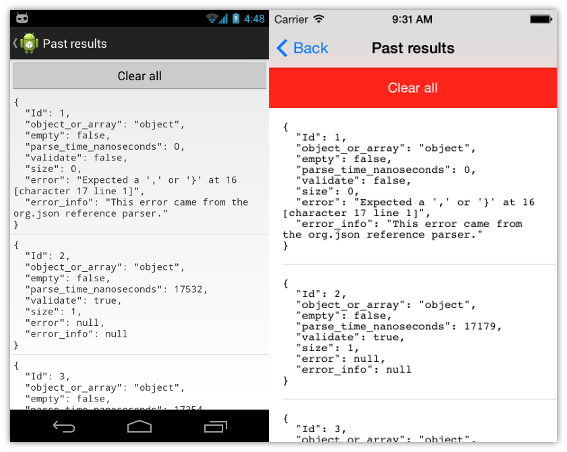
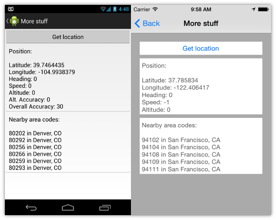

Files
-----
`Core` - Library project containing code to be shared across platforms  
`AndroidUsingCore` - Xamarin.Android project  
`iPhoneUsingCore` - Xamarin.iOS iPhone project  
`Components` - Directory containing Xamarin Component files  
`packages` - Directory containing NuGet package files

Screenshots
-----

Notes
-----
* You might need a NuGet plugin
* The single solution contains all three projects. This was set up in Xamarin Studio but I assume everything will work the same way in Visual Studio
* The Android and iPhone projects each reference the compiled file `Core/bin/debug/Core.dll`